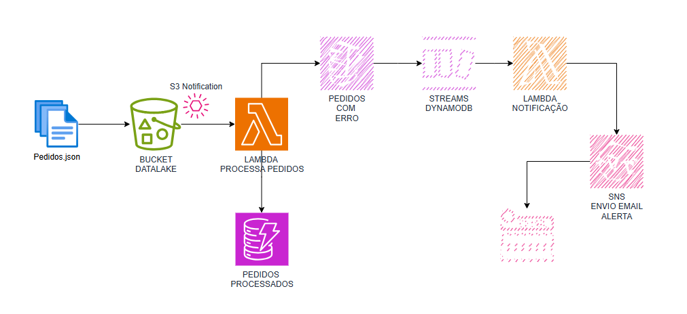

# AWS Lambda: Processamento e Validação de Pedidos com Armazenamento no DynamoDB

Este projeto contém uma função AWS Lambda que processa arquivos JSON de pedidos carregados em um bucket S3. A função realiza validações básicas nos dados e armazena os pedidos válidos em uma tabela DynamoDB. Caso algum pedido esteja incorreto, ele é armazenado em uma segunda tabela para pedidos inválidos.




## Estrutura do Projeto

- **lambda_function.py**: Arquivo principal contendo o código da função Lambda.
- **README.md**: Este documento com a explicação e instruções.
- **event.json**: Exemplo de evento S3 para testar a Lambda.

## Recursos Utilizados

- **AWS Lambda**: Função Lambda para processar os arquivos JSON.
- **Amazon S3**: Bucket S3 onde os arquivos JSON são carregados.
- **Amazon DynamoDB**: Duas tabelas DynamoDB, uma para armazenar pedidos válidos e outra para pedidos inválidos.
  
## Fluxo da Aplicação

1. Um arquivo JSON contendo um ou mais pedidos é enviado para o bucket S3.
2. A função Lambda é invocada automaticamente por meio de um evento S3.
3. A função Lambda faz o download do arquivo JSON, processa cada pedido e realiza as seguintes ações:
   - Valida se todos os campos obrigatórios estão presentes no pedido.
   - Se o pedido for válido, ele é inserido na tabela `PedidosTable`.
   - Se o pedido for inválido (dados ausentes ou incorretos), ele é inserido na tabela `PedidosIncorretosTable` com o motivo do erro.
   
## Como Configurar

### 1. Criação das Tabelas no DynamoDB

- **PedidosTable**:
  - `Partition Key`: `orderId` (Tipo: String)
  - `Sort Key`: `status` (Tipo: String)

- **PedidosIncorretosTable**:
  - `Partition Key`: `orderId` (Tipo: String)
  - `Sort Key`: `errorTimestamp` (Tipo: String)

### 2. Criação da Função Lambda

- Crie uma função Lambda no console da AWS.
- Copie o código de `lambda_function.py` para a função.
- Conceda as permissões necessárias para que a função possa acessar o DynamoDB e o S3.

### 3. Configuração de Permissões IAM

- A função Lambda precisa de permissões para acessar:
  - `dynamodb:PutItem` para inserir dados nas tabelas DynamoDB.
  - `s3:GetObject` e `s3:ListBucket` para acessar os arquivos no bucket S3.

A função Lambda precisa de permissões para acessar o S3 (para ler os arquivos) e o DynamoDB (para inserir os dados). Siga os passos abaixo para configurar a política de permissões:

1. Nas opções da Lambda acesse `Configuration`, depois `Permissions` e clique no nome da Role.
2. Clique em **Create inline Policy** e selecione **JOSON**.
5. Crie uma nova política personalizada com as seguintes permissões:

```json
{
    "Version": "2012-10-17",
    "Statement": [
        {
            "Effect": "Allow",
            "Action": [
                "dynamodb:PutItem",
                "dynamodb:GetItem"
            ],
            "Resource": [
                "arn:aws:dynamodb:REGIAO:ID_DA_CONTA:table/PedidosTable",
                "arn:aws:dynamodb:REGIAO:ID_DA_CONTA:table/PedidosIncorretosTable"
            ]
        },
        {
            "Effect": "Allow",
            "Action": [
                "s3:GetObject",
                "s3:ListBucket"
            ],
            "Resource": [
                "arn:aws:s3:::NOME_DO_BUCKET",
                "arn:aws:s3:::NOME_DO_BUCKET/*"
            ]
        }
    ]
}
```

### 4. Criação do Bucket S3

- Crie um bucket S3 onde os arquivos JSON serão carregados.
- Configure uma notificação de evento do tipo **PUT** no bucket para invocar a função Lambda quando novos arquivos forem enviados.


### 5. Teste do Sistema

- Envie um arquivo JSON para o bucket S3.
- A função Lambda será automaticamente invocada, e os pedidos serão processados e armazenados no DynamoDB.
- Verifique os logs da Lambda no CloudWatch para garantir que tudo funcionou corretamente.

## Exemplo de Arquivo JSON de Pedidos

Aqui está um exemplo de como o arquivo JSON de pedidos pode ser estruturado:

```json
[
  {
    "orderId": "100001",
    "customerName": "João Silva",
    "customerEmail": "joao.silva@email.com",
    "totalAmount": 120.75,
    "status": "Pendente",
    "orderDate": "2024-09-16T08:30:00Z"
  },
  {
    "orderId": "100002",
    "customerName": "Maria Souza",
    "customerEmail": "maria.souza@email.com",
    "totalAmount": 75.99,
    "status": "Pendente",
    "orderDate": "2024-09-16T09:00:00Z"
  }
]
```

### Próximos Passos

- Refine o código para adicionar mais validações conforme necessário.
- Experimente diferentes tipos de validação ou tratamento de erros.
- Adicione mais funcionalidades, como notificações em caso de erro, na próxima fase da aula.
