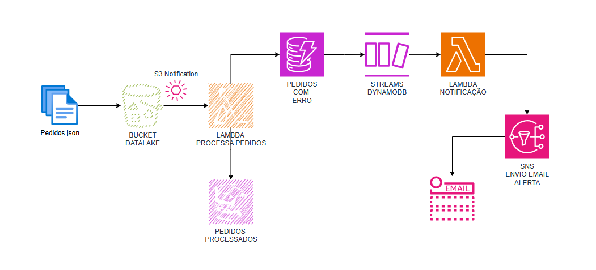

# Projeto AWS Lambda: Processamento de Pedidos Incorretos com URLs Pré-assinadas e SNS

Este projeto implementa uma função AWS Lambda que é acionada por eventos do **DynamoDB Streams** quando um novo item é inserido em uma tabela **DynamoDB**. A função gera uma URL pré-assinada para um objeto no **Amazon S3** e envia uma notificação contendo essa URL, junto com os detalhes do pedido, para um tópico **Amazon SNS**.




## Funcionalidades Principais

1. **Processamento de Pedidos Incorretos**:
   - A função é invocada por eventos do DynamoDB Stream, quando um novo pedido incorreto é inserido na tabela DynamoDB.
   - Ela extrai os dados do pedido incorreto, incluindo o `orderId`, o motivo do erro e o nome do arquivo no S3.

2. **Geração de URL Pré-assinada**:
   - Para cada pedido, uma URL pré-assinada é gerada para permitir o acesso ao arquivo no S3 por um tempo limitado.

3. **Notificação via SNS**:
   - Todos os detalhes do pedido incorreto, juntamente com a URL pré-assinada, são enviados para um tópico SNS configurado.

## Estrutura do Projeto

- `lambda_function.py`: Código principal da função Lambda.
- `README.md`: Este arquivo de documentação.

## Fluxo de Execução

1. **Recebimento do evento de stream do DynamoDB**: 
   - A função Lambda é invocada automaticamente quando um novo pedido incorreto é inserido na tabela DynamoDB.

2. **Extração dos dados do pedido**:
   - A função extrai os detalhes do pedido, como o `orderId`, `errorReason`, `bucketName`, e o `fileName` do arquivo no S3.

3. **Geração de URL pré-assinada**:
   - A função gera uma URL pré-assinada que permite acesso temporário ao arquivo do pedido incorreto no S3.

4. **Envio dos detalhes para o SNS**:
   - A URL pré-assinada e os detalhes do pedido são enviados para um tópico SNS configurado.

## Estrutura da Tabela DynamoDB

### Tabela `PedidosIncorretosTable`

| Nome do Campo  | Tipo        | Descrição                            |
|----------------|-------------|--------------------------------------|
| `orderId`      | String      | ID do pedido incorreto (PK)          |
| `errorTimestamp`| String     | Timestamp do erro                    |
| `bucketName`   | String      | Nome do bucket de origem             |
| `fileName`     | String      | Nome do arquivo processado           |
| `orderData`    | Map         | Dados do pedido com erros            |
| `errorReason`  | String      | Motivo do erro                       |

## Variáveis de Ambiente

A função Lambda utiliza as seguintes variáveis de ambiente:

- `BUCKET_NAME`: Nome do bucket S3 onde os arquivos de pedidos estão armazenados.
- `SNS_TOPIC_ARN`: ARN do tópico SNS para onde os detalhes do pedido incorreto serão enviados.
- `URL_EXPIRATION`: (Opcional) Tempo de expiração da URL pré-assinada, em segundos. Padrão: 600 segundos (10 minutos).

## Exemplo de Evento de Stream do DynamoDB

```json

{
  "Records": [
    {
      "eventID": "1",
      "eventName": "INSERT",
      "dynamodb": {
        "NewImage": {
          "orderId": { "S": "100001" },
          "errorTimestamp": { "S": "2024-09-16T08:30:00Z" },
          "bucketName": { "S": "meu-bucket" },
          "fileName": { "S": "pedidos/pedido_100001.json" },
          "errorReason": { "S": "Campo ausente: customerEmail" },
          "orderData": {
            "M": {
              "customerName": { "S": "João Silva" },
              "totalAmount": { "N": "120.75" }
            }
          }
        }
      }
    }
  ]
}

```

## Como Testar

1. Crie uma tabela no DynamoDB (`PedidosIncorretosTable`) com suporte para streams.
2. Suba a função Lambda com o código fornecido no arquivo `lambda_function.py`.
3. Configure o Stream do DynamoDB para invocar a Lambda quando novos pedidos incorretos forem inseridos.
4. Teste inserindo itens na tabela DynamoDB para simular pedidos incorretos.
5. Verifique se as URLs pré-assinadas foram geradas e enviadas corretamente para o SNS.

## Permissões Necessárias

A Lambda deve ter permissões para:

- `s3:GetObject`
- `sns:Publish`
- `dynamodb:StreamRead`
- `logs:CreateLogGroup`, `logs:CreateLogStream`, e `logs:PutLogEvents` (para logging no CloudWatch)

Exemplo de política IAM:

```json

{
    "Version": "2012-10-17",
    "Statement": [
        {
            "Effect": "Allow",
            "Action": [
                "s3:GetObject",
                "sns:Publish",
                "dynamodb:GetRecords",
                "dynamodb:GetShardIterator",
                "dynamodb:DescribeStream",
                "dynamodb:ListStreams",
                "logs:CreateLogGroup",
                "logs:CreateLogStream",
                "logs:PutLogEvents"
            ],
            "Resource": [
                "arn:aws:s3:::nome-do-bucket/*",
                "arn:aws:sns:REGIAO:ID_DA_CONTA:meu-topico-sns",
                "arn:aws:dynamodb:REGIAO:ID_DA_CONTA:table/PedidosIncorretosTable",
                "arn:aws:logs:REGIAO:ID_DA_CONTA:*"
            ]
        }
    ]
}

```

## Contato

Caso tenha dúvidas ou sugestões, entre em contato.
